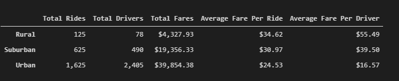
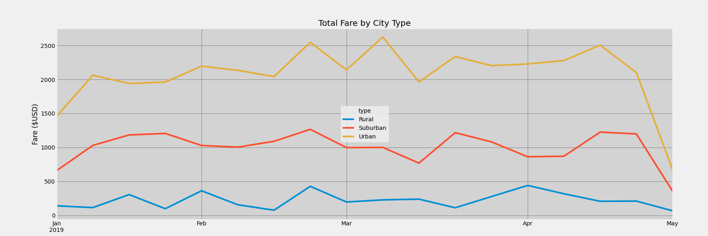

# Pyber City Type Analysis
## Project Overview
The purpose of this project was to analyze ride share data from different city type classifications. The data was analyzed on a weekly basis with a focus on determining how differences in weekly fare trends may be used to drive future revenue maximizing strategies for the business. 

## Results 
### Pyber City Type Fare Summary
When reviewing the average fare per ride and average fare per driver in each city type we see that Rural and Suburban cities have higher average fares and drivers are making more per ride on average than in Urban cities. The higher dollar value per ride in Urban and Suburban cities relative to Urban cities may warrant further analysis. A likely reason for the discrepencies are the typical civil layouts of each city type. 

Total fare paid is directly proportional to the distance and time required to complete a PyBer trip. We can reasonably assume trips in both Suburban and Rural cities would cover more distance and therfore would require a higher fare.

Despite the higher average fares in Suburban and Rural cities, the data shows PyBer makes the majority of their revenue from Urban cities. The number of Urban trips was 1,000 higher than the next closest city type, Suburban, and 1,500 greater than the lowest ranking city type, Rural. 

We can use similar logic from our analysis of why Suburban and Rural fares are generally higher than Urban fares to make assumptions about the Urban city type data. Urban populations tend to be more dense which may help explain the significantly higher number of drivers in Urban cities. Additionally, people living in Urban cities may be less likely to own their own vehicle and rely more on services like PyBer for transportation. 

### Pyber City Type Fares Over Time
The following analysis is based on the interpretation of weekly fares charged in each city type over the first four months of 2019. 

The weekly data over time again shows the relative importance of Urban cities to PyBer's bottom line. Rural cities never accounted for more than $500 of revenue in a given week. Suburban cities accounted for a higher percentage on a weekly basis. 

we can also see from the data that weekly Urban fares may have a positive seasonal effect during the end of February and the beginning of March. This could be due to more people travelling around those dates. US school spring breaks typically fall within this time period. Interestingly, we also see a decline in Suburban city revnue during this same time period. It is possible the revenue dip in Suburban cities and the revenue boost in Urban cities may be directly correlated, with Suburban demand shifting to Urban cities as people travel. Rural city revenue tended to be less volatile and does not show signs of seasonality. 
  
### Analysis Applications and Recommendations
Based on the analysis I suggest the following recommendations for future business objectives. 

1) PyBer should analyze driver growth rates in Urban areas. With Urban areas representing such a high and consitent revneue source for Pyber increasing addoption by drivers in Urban areas would quickly increase incoming revenues. Signs of a slowdown in driver onboarding or participation would be a sign that PyBer may need to focus on new growth markets. 

2) Seasonality should be taken into consideration when running promotions and in marketing initiatives. The incease in Urban fares during a time of the year typically associated with travel indicates PyBer could benefit from increasing marketing and promotional costs during this time period to acquire more riders and increase driver pools. 

3) Pyber should use the higher fare data to help promote driver adoption in Rural and Suburban cities. While rapid adoption would ultimately drag down the average fares earned per ride by new drivers, marketing materials showing how much more a driver can make per ride in a Rural city could help increase adoption of PyBer in Rural markets. 
